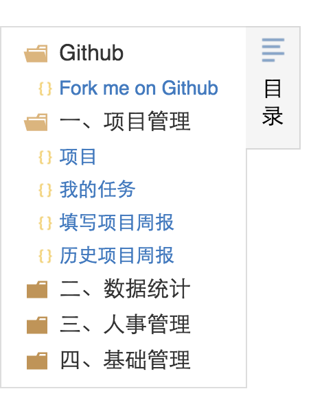
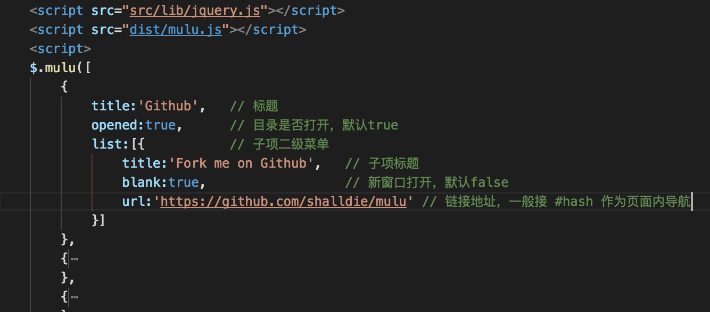

# mulu
用于在右侧显示文章目录的小插件  :D

## 看起来是这个样子的



# 用法

    1.引入 jquery 跟 mulu.js 
    2.实例化插件:

```js
    $.mulu([
        {
            title:'Github',   // 标题
            opened:true,      // 目录是否打开，默认true
            list:[{           // 子项二级菜单
                title:'Fork me on Github',   // 子项标题
                blank:true,                  // 新窗口打开，默认false
                url:'https://github.com/shalldie/mulu' // 链接地址，一般接 #hash 作为页面内导航
            }]
        },
        ...
        ]);
```

